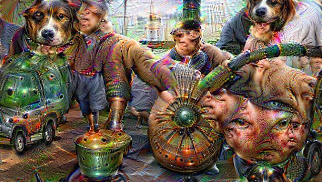

# Build Caffe for Google DeepDream



## Base Environment

[data science toolbox](http://datasciencetoolbox.org/)

## Reference

- [Google Inceptionism blog](http://googleresearch.blogspot.tw/2015/06/inceptionism-going-deeper-into-neural.html)


- [Google Deep Dream blog](http://googleresearch.blogspot.tw/2015/07/deepdream-code-example-for-visualizing.html)


- [Google Deep Dream github](https://github.com/google/deepdream/)


- [Caffe github](https://github.com/BVLC/caffe)


- [Caffe Installation reference](http://sohliloquies.blogspot.tw/2015/07/setting-up-deep-dream-google-researchs.html)

## Installation

``` shell
sudo apt-get update

# requirements
sudo apt-get install -y cmake libatlas-base-dev libprotobuf-dev libleveldb-dev libsnappy-dev libopencv-dev libboost-all-dev libhdf5-serial-dev libgflags-dev libgoogle-glog-dev liblmdb-dev protobuf-compiler

# get caffe source code
cd
git clone https://github.com/BVLC/caffe
cd caffe
cp Makefile.config{.example,}
# uncomment "CPU_ONLY := 1" at line 8 because I don't have CUDA
sed -i'' '8 s/^# //' Makefile.config

# build caffe
mkdir build
cd build
cmake ..
make pycaffe
make runtest

# install pycaffe requirements
cd ../python
sudo pip install -r requirements.txt

# add caffe to pythonpath
# export PYTHONPATH=$HOME/caffe/python:$PYTHONPATH in .bashrc
echo "export PYTHONPATH=$HOME/caffe/python:\$PYTHONPATH" >> ~/.bashrc
source ~/.bashrc

# download google's model for caffe
cd ../models/bvlc_googlenet/
wget http://dl.caffe.berkeleyvision.org/bvlc_googlenet.caffemodel

# download google's source code
cd
git clone https://github.com/google/deepdream/

# used in google's source code
sudo pip install jsonschema
```

## Extra

[Build OpenCV 3.0.0-bate for Python](Build OpenCV 3.0.0-bate for Python.md)

source of the testing image:

